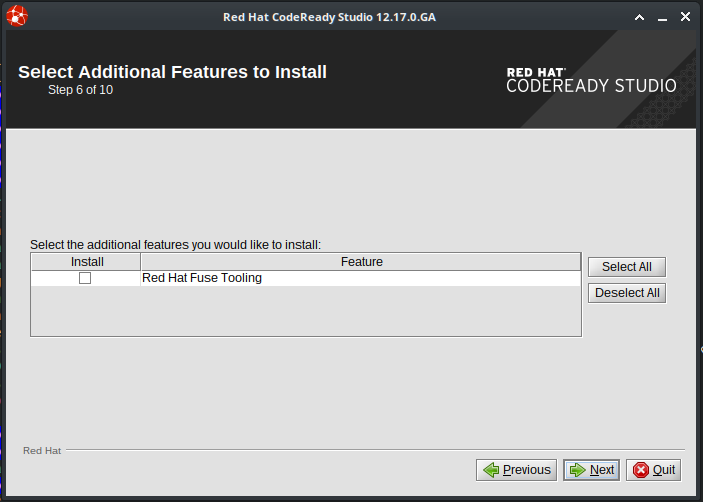
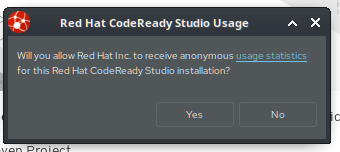
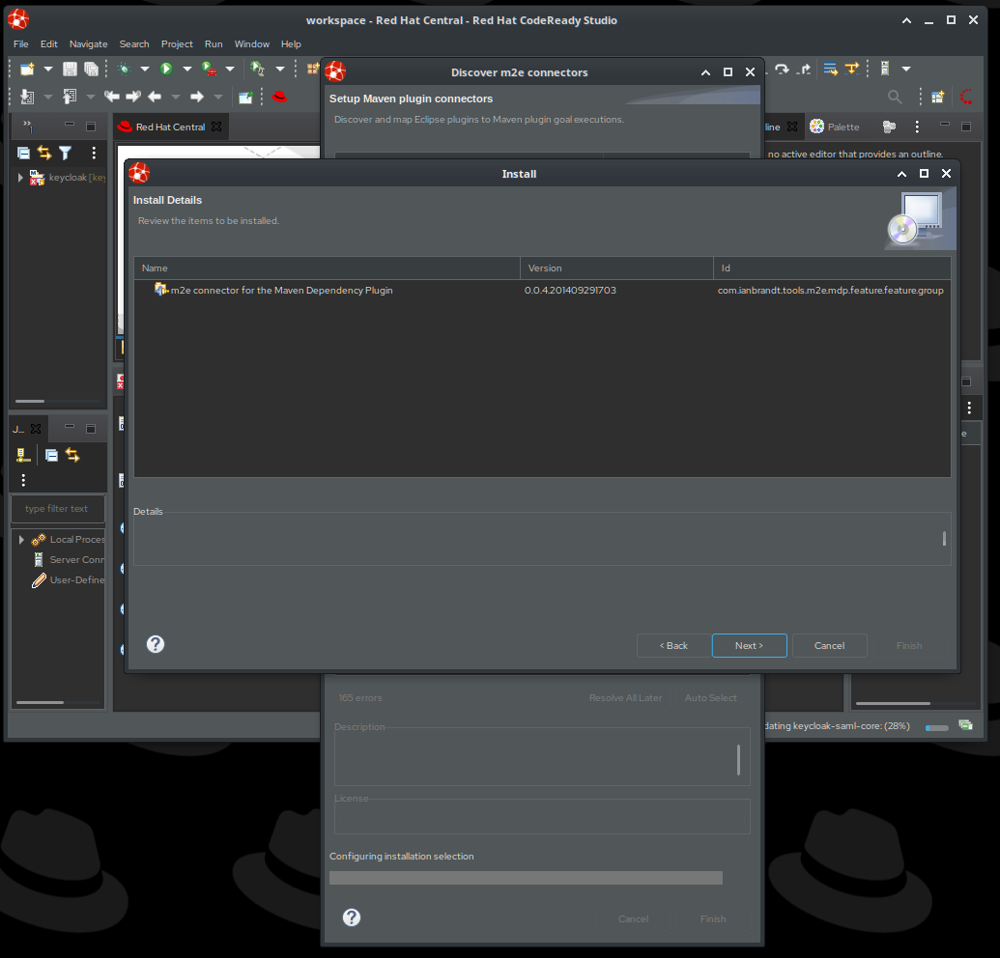
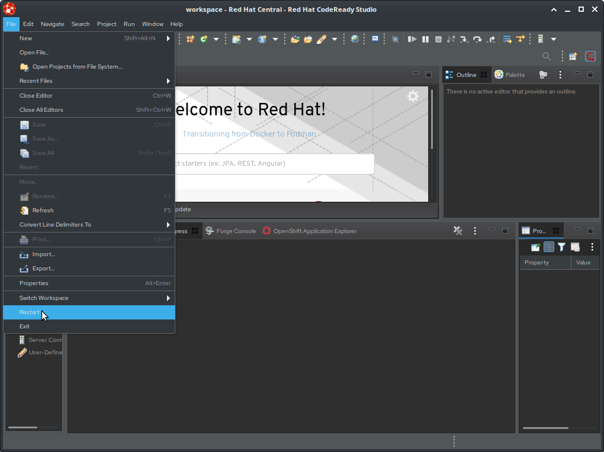
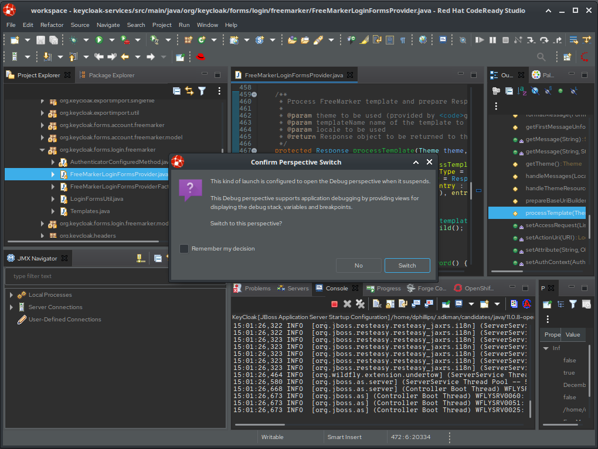

# Debugging KeyCloak

## Source Code

[.text-left]
. Create a new "workspace" directory and open a terminal in that directory
+
[NOTE]
====
For the duration of these instructions, we will refer to this workspace directory as `/home/dphillips/workspace`
====
. git clone https://github.com/keycloak/keycloak.git
. Change to the keycloak source directory
   * `cd keycloak`
. Check out the appropriate version
   * `git checkout -b 9.0.3 9.0.3`
     * This creates a new local branch `9.0.3` using the git tag `9.0.3`
. Download the corresponding version of KeyCloak/Red Hat SSO and extract it

<<<

## CodeReady Studio

[.text-left]
. Download Red Hat CodeReady Studio
   * https://developers.redhat.com/products/codeready-studio/download[https://developers.redhat.com/products/codeready-studio/download]
   
. Log in or create a Red Hat Developers account to complete the download
. Download the installer JAR file
. Execute the Installer JAR
   * `java -jar /path/to/codeready.jar`
+
<<<
. Read the installer instructions and click "Next"
  
. Review the license agreement, select "I accept", and click "Next"
   
+
<<<
. Update the installation path (OPTIONAL) and click "Next"
   
. Click "OK" to acknowledge the warning that a new directory will be created
   
+
<<<
. Either accept the default JVM or choose a specific JVM
+
[NOTE]
====
The JVM **MUST** be Java 11 or later
====
+

+
<<<
. Add the KeyCloak server instance to the list (This MAY fail and there are instructions later to add it after installation)
   
. You can optionally include Red Hat Fuse Tooling
   
+
<<<
. Review the installation details and click "Next" to begin the installation
   
. The installation will take a few minutes
   
+
<<<
. Once the install is complete, click "Next"
   
. You may choose to have the installer create menu entries and then click "Next"
   
+
<<<
. Select "Run Red Hat CodeReady Studio after installation" and click "Next"
   

## Import KeyCloak Maven Multi-Module Project

[.text-left]
. As CodeReady Studio starts, select your workspace as determined at the beginning of these instructions
   
+
<<<
. Choose "Yes" or "No" to the prompt about usage statistics collection
   
. Select the "Servers" panel
   
+
<<<
. Click the link in the "Servers" panel to add a new Server
   * Choose "Red Hat JBoss Enterprise Application Server 7.0.3"
   * Set the server name to "keycloak"
   
+
<<<
. Accept the defaults for the server adapter and click "Next"
   image:images/Import_KeyCloak_Source_07.png[]
+
<<<
. In the "New Server" dialog:
   * Set the "Name" to "KeyCloak"
   * Browse to your KeyCloak server download (the binary package)
   * Select the "Runtime JRE"
   
+
<<<
. On the "Add and Remove" dialog, click "Finish"
   
+
<<<
. In the "File" menu, select "Import"
   
+
<<<
. Under the "Maven" folder, select "Existing Maven Projects"
   
+
<<<
. Browse to and select your KeyCloak source directory (e.g. /home/dphillips/workspace/keycloak), then click "Finish"
   
+
<<<
. Make note that there are background processes running, and double-click on that progress bar.
   
+
<<<
. You will see a series of processes running which can take a **VERY LONG TIME** and which must complete before we can proceed.
   
+
<<<
. You will see a dialog about unknown maven plugin connectors. Click "Auto Select" and then click "Finish"
   
+
<<<
. You may get a warning about incomplete maven goals but you can click "OK" to proceed.
   
+
<<<
. You might be prompted to install additional M2E Connectors for Eclipse, click "Next"
   
+
<<<
. You will then be shown the installation details for that M2E plugin. Click "Next"
   
+
<<<
. Accept the license agreement for the M2E connectors
   
+
<<<
. You may get a warning about unsigned software for the M2E Connectors, you can ignore it by clicking "Install Anyway"
   
. You will be prompted to restart the IDE to apply the new plugins. Click "No" and wait for the remaining background tasks to complete.
   
+
<<<
. Once all of the background tasks have completed, select "File" -> "Restart"
   
+
<<<

[.text-left]
## Running The Debugger & Setting Breakpoints
. Navigate to the "Servers" pane, select "KeyCloak", and then click the "Debug" button
   
+
<<<
. Once the KeyCloak server is completely started, navigate in the project explorer to the `keycloak-services` module, to the `org.keycloak.forms.login.freemarker` package, and open the `FreeMarkerLoginFormsProvider` class.
   
+
<<<
. Locate the "processTemplate" method
   
+
<<<
. Set a breakpoint on the first line inside of the `try/catch` block
   
+
<<<
. Open a browser and navigate to the keycloak server at http://localhost:8080/auth/realms/<realm>/<client>/, and you should expect to be prompted to switch to the Debugging perspective in your IDE
   
+
<<<
. Now you can inspect the `this.attributes` field to see what is being passed to FreeMarker
   